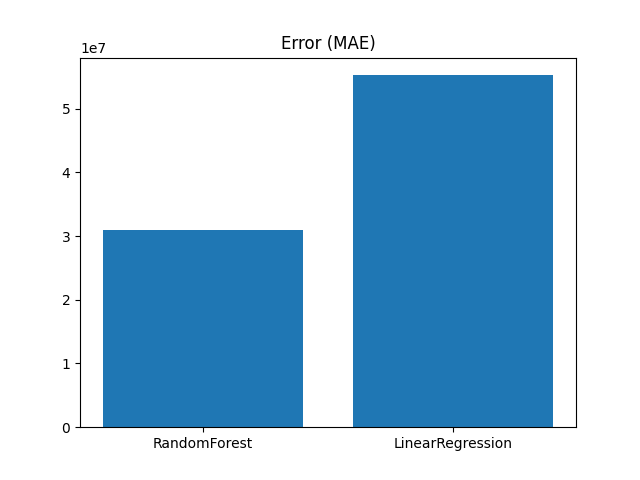

# 🧠 Mineral Revenue Intelligence System (MRIS).

## 🚀 Overview
The **Mineral Revenue Intelligence System (MRIS)** is an advanced Machine Learning project that analyzes and predicts mineral revenue patterns using real-world datasets.

This system integrates multiple **bio-inspired optimization algorithms** with Machine Learning to:
- 📊 Analyze revenue trends
- 🔮 Predict future outcomes
- ⚡ Optimize feature selection
- 📉 Evaluate model performance visually

---

## 👤 Author
**Sagnik Patra**

---

## 🎯 Objectives
- Analyze mineral-wise revenue data
- Build predictive ML models
- Apply optimization algorithms for feature selection
- Generate visual insights (graphs, heatmaps)
- Export results in multiple formats

---

## 🧠 Algorithms Implemented

| Algorithm | Description |
|----------|------------|
| AIS | Artificial Immune System |
| CSA | Crow Search Algorithm |
| PSO | Particle Swarm Optimization |
| QPSO | Quantum Particle Swarm Optimization |
| BA | Bat Algorithm |
| HSA | Harmony Search Algorithm |
| GWOA | Grey Wolf Optimization Algorithm |
| WOA | Whale Optimization Algorithm |

---

## ⚙️ Tech Stack
- Python 🐍
- Pandas, NumPy
- Scikit-learn
- Matplotlib, Seaborn
- Joblib, YAML, JSON

---

## 📊 Visual Outputs

### 📉 Error Graph


### 📊 Heatmap
- Correlation between features

### 📈 Prediction Graph
- Actual vs Predicted values

### 📊 Accuracy Graph
- Model performance (R2 score)

---

## 📂 Project Structure


Mineral-Revenue-Intelligence-System/
│
├── data/
│ └── mineral_wise_revenue_collected.csv
│
├── outputs/
│ ├── ais_.
│ ├── csa_.
│ ├── pso_.
│ ├── qpso_.
│ ├── ba_.
│ ├── hsa_.
│ ├── gwoa_.
│ ├── woa_.
│
├── error_graph.png
├── README.md


---

## 📈 Key Features

### 🔍 Data Processing
- Handles missing values
- Converts string values to numeric
- Encodes categorical variables

---

### 🧬 Optimization
- Uses multiple metaheuristic algorithms
- Selects best feature subsets
- Improves model accuracy

---

### 🤖 Machine Learning
- Random Forest Regressor
- Model evaluation (MAE, R²)

---

### 📊 Visualization
- Heatmaps
- Prediction graphs
- Accuracy comparison
- Error analysis

---

### 📦 Outputs Generated
- `.csv` → Predictions & Results
- `.pkl` → Trained models
- `.yaml` → Configuration
- `.json` → Insights
- `.png` → Graphs

---

## ▶️ How to Run

### 1️⃣ Install Dependencies
```bash
pip install pandas numpy scikit-learn matplotlib seaborn joblib pyyaml
2️⃣ Run Any Algorithm Script
python your_script.py
3️⃣ Outputs

All outputs will be saved in:

C:\Users\NXTWAVE\Downloads\Mineral Revenue Intelligence System
💼 Use Cases
Government policy analysis
Mining sector optimization
Revenue forecasting
Data-driven decision making
🔥 Highlights
Real-world dataset 🇮🇳
Multiple optimization algorithms
End-to-end ML pipeline
Strong portfolio project
📌 Future Improvements
Streamlit Dashboard 🌐
LLM-based Insight Generator 🤖
Real-time data integration 📡
Hybrid optimization models ⚡
⭐ Conclusion

This project demonstrates the power of combining:

Machine Learning
Optimization Algorithms
Data Visualization

to create a complete intelligence system for decision-making.

⭐ If you like this project

Give it a ⭐ on GitHub!
